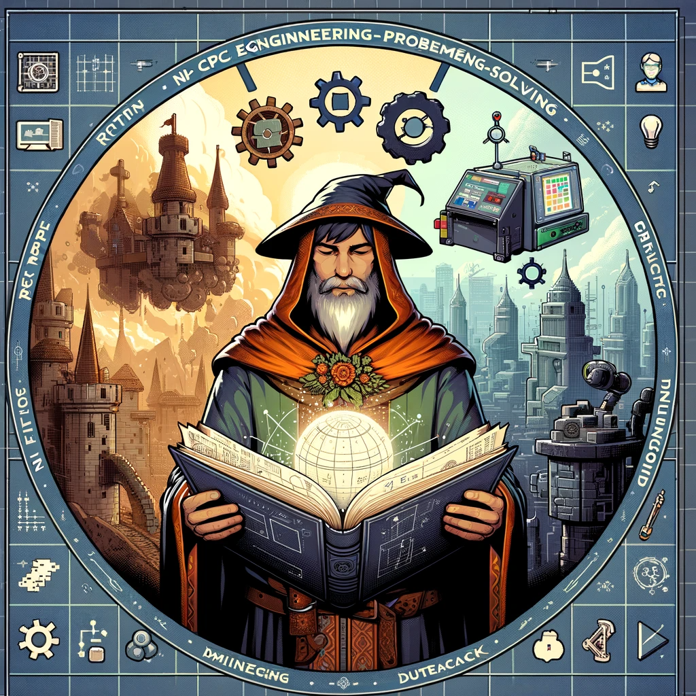
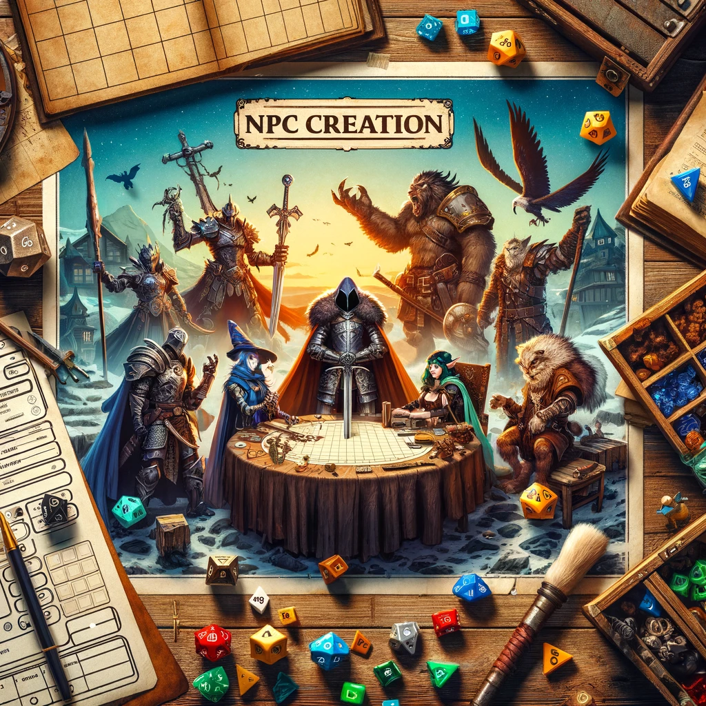
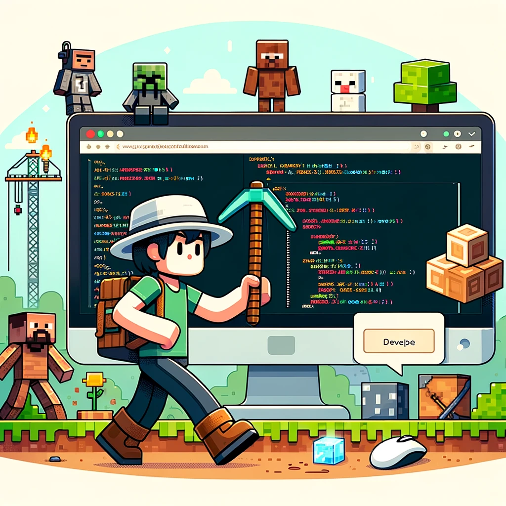

# Multi-Faceted ChatGPT Extensions 

Welcome to my collection of specialized ChatGPT extensions, each designed to cater to specific interests and needs.

## [NPC Crafter for RPG](https://chat.openai.com/g/g-7HC8U0EuN-npc-crafter)
**Create Immersive NPCs for Your Role-Playing Games:** Unleash your imagination and enhance your tabletop RPG experience with tailored NPC (Non-Player Character) creation. This tool assists in generating unique and compelling characters to populate your game worlds.

## [Engineering Assistant](https://chat.openai.com/g/g-sAWXG5Y6P-engineering-assistant)
**Solving Engineering Challenges Made Easier:** Tackle complex engineering problems with an assistant designed for students and professionals alike. This ChatGPT extension provides insights, solves equations, and helps brainstorm solutions in various engineering fields.

## [MC Datapack Wizard](https://chat.openai.com/g/g-WH03GDgAf-mc-datapack-wizard)
**Enhance Your Minecraft Experience:** Elevate your Minecraft gameplay with custom datapacks. Whether you're looking to add new features or tweak existing ones, this tool simplifies the creation and editing process, making your Minecraft world truly yours.

